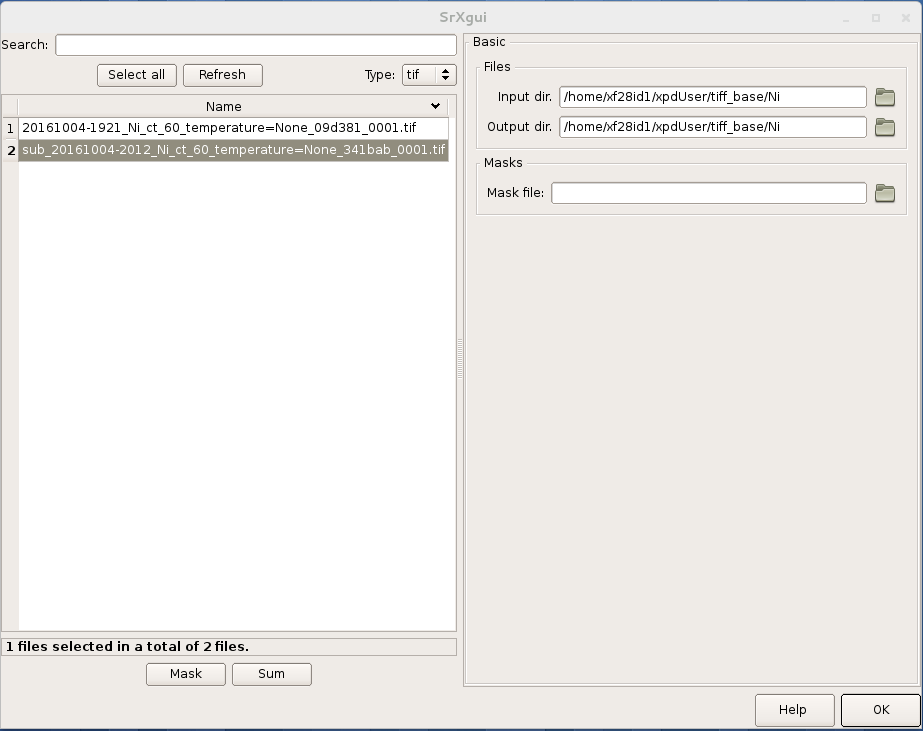
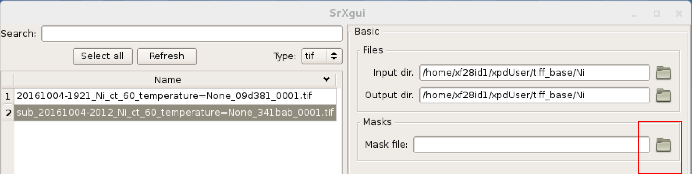
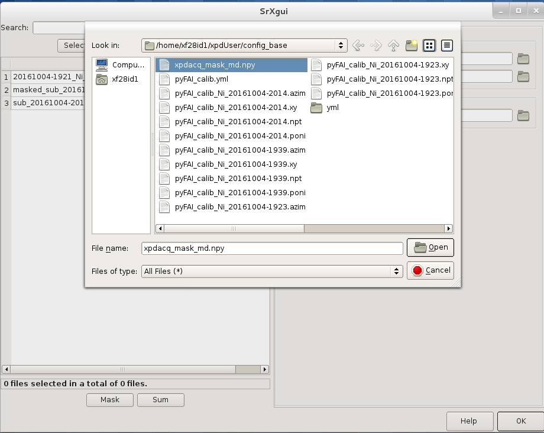

.. _quick_start:

Quick Start
===========

This quick-start contains little explanation of how the ``xpdAcq`` software works.
To understand this, please refer to the detailed documentation in :ref:`xpdu`

Please use this page as a reminder of the workflow and to copy & paste code snippets into your
active ``collection`` and ``analysis-dev`` ipython environments (then hit return).

Remember, to post questions about anything XPD, including software, and to see archived answers, at the `XPD-Users Google group
<https://groups.google.com/forum/#!forum/xpd-users;context-place=overview>`_ .  If you are not already a member please request to join
the community

OK, let's get started.

Check your data collection environment is correctly set up
----------------------------------------------------------

1. Make sure you are working in the correct environment. For data acquisition you should be
in the ``collection`` ipython environment. You should see ``In[#]:`` which indicates you are
in an ipython environment. To check what the environment is type

.. code-block:: python

  !conda list

It lists all the python packages in your environment, but the name of the environment
is at the end of the line at the top.  It should say ``something something/something/collection``
which tell you that you are in the ``collection`` environment.

If you see something more like ``/direct/pe1_data/userArea/XPDhome/xpdUser`` then
type

.. code-block:: python

  icollection

to activate the collection environment.

2. Make sure that the software has been properly configured for your beamtime. In
your ``collection`` environment, type:

.. code-block:: python

  bt.md

This should return a list of metadata about your experiment, such as PI last name.  If not,
or if the metadata is wrong, please get your beamtime environment properly
set up by the instrument scientist (IS) before proceeding.

.. note::

  Only create and work on files within the ``xpdUser`` directory tree.  At the end of your
  experiment, everything written in there will be permanently archived in a remote store
  and then deleted from the xpd computer leaving
  a clean environment for the next user.  You can, of course, take anything home from within ``xpdUser``,
  or if you forgot something have the IS fetch it for you from the archive later.

Check that your data analysis environment is correctly set up
-------------------------------------------------------------

1. Analysis is done in a separate (but very similar) environment to acquisition.
This will be in a separate terminal window on the computer (or even on a different computer)
to the collection environment.  Try and find the right terminal window.
For data analysis you should be
in the ``analysis-dev`` ipython environment You should see ``In[#]:`` which indicates you are
in an ipython environment. To check what the environment is type

.. code-block:: python

  !conda list

now you are looking for ``something something/something/analysis-dev``
on the top line of the output,
which tell you that you are in the right analysis environment.

If you see something more like ``/direct/pe1_data/userArea/XPDhome/xpdUser`` then
type.

.. code-block:: python

  ianalysis

2. Make sure that the software has been properly configured for your beamtime. In
your ``analysis`` environment, type:

.. code-block:: python

  an.md

This should return a list of metadata about your experiment, such as PI last name.  If not
please get your analysis environment set up by the instrument scientist before proceeding.

3. Make sure the visualization software is running. We will use ``SrXgui`` and ``XPDsuite`` for visualizing data.
Check that they are running by finding windows that looks like:

**XPDsuite**

.. image:: ./img/XPDsuite.png
  :width: 400px
  :align: center
  :height: 300px

**SrXgui**

If you can't find them, contact your IS to get them running correctly.

Set up your experiment
----------------------
0. general
""""""""""

If you want to query any ``xpdAcq`` or ``xpdAn`` function, type the function name with a ``?`` at the end and hit
return.  Documentation for what parameters the function takes, and any default values, and what
the function returns will be printed.  For example, in your ``collection`` terminal type:

.. code-block:: python

  run_calibration?

If you can't remember what functions are available, but can remember the first letter or first few
letters, type those letters and hit ``tab`` to see a list of all available functions that begin with
those letters. This will include Python imported and built-in functions as well as xpdAcq ones.

0.5 quick look
""""""""""""""

Place any sample, but maybe the Ni calibrant, at the sample position.  Let's make sure we are getting a nice
Ni diffraction pattern. In your ``collection`` terminal type:

.. code-block:: python

  xrun(0,0) # will run an exposure of 60 seconds on your setup sample
  save_last_tiff() # will save the image in the tiff_base/Setup directory

Note, if the software gives an error that it cannot find the sample object, then you will need
to load a sample spreadsheet.  See section 3 below: `set up Sample objects to use later`

Navigate to the ``SrXgui`` image viewer. Click on the folder icon and navigate to
the ``tiff_base/Setup`` folder and look for a list of one or more tiff files.
Double-click on the most recent one to view the one you just collected.

1. calibration
""""""""""""""
run this first, then run it again each time the geometry of your measurement changes.

Place the Ni calibrant at the sample position, close the hutch and open the shutter then type in your ``collection`` terminal:

.. code-block:: python

  run_calibration() # default values (calibrant_file='Ni.D' and exposure=60) don't need to be typed

and follow the instructions in :ref:`calib_manual`.

The resulting calibration parameters will be saved in the header of every scan you run until you
run ``run_calibration()`` again.

2. set up a mask
""""""""""""""""

The standard mask removes problematic pixels at the edge of the detector, shadows
the beamstop, and uses an auto-masking scheme to get rid of outlier pixels.
The automasking has been extensively tested on a low-scattering sample so our mask
building function has been designed to run on data from an empty kapton tube.
Load an empty kapton tube on the diffractometer, then in your ``collection`` terminal type

.. code-block:: python

  run_mask_builder() # be patient, the process takes 10 minutes!

A mask will be generated based on the image collected from this sample. This mask
will be saved in the header of all future scans until you run ``run_mask_builder()``
again.  You will always be able to extract your data unmasked, or apply a different mask,
at analysis time, but if this mask works well, it will save you a lot of time later if
you do this step now.

You can look at the 2D image with and without the mask in SrXgui.
You can load the mask file by clicking the 'folder' icon in SrXgui, navigating
to the ``tiff_base/setup`` folder and looking for a file with a long sample name
and the extension ``.npy``. Select and load this file in the SrXgui mask dialog box.

For more info: :ref:`auto_mask`.

3. set up ``Sample`` objects to use later
"""""""""""""""""""""""""""""""""""""""""

Your sample information should be loaded in an excel spreadsheet, with a well
defined format (a template file may be found `here
<https://groups.google.com/forum/?utm_medium=email&utm_source=footer#!topic/xpd-users/_6NSRWg_-l0>`_
). If the IS didn't already
do it, save your sample xls file to the ``xpdUser/import`` directory using the name
``<saf_number>_sample.xlsx``, where you replace ``<saf_number>`` with the number
of the safety approval form associated with your experiment.  If you are not sure
what your ``saf_number`` is you can get it by typing following command in your ``collection`` terminal:

.. code-block:: python

  In[1] bt
  Out[1]:
  {'bt_experimenters': ['Tim', 'Liu'],
   'bt_piLast': 'Billinge',
   'bt_safN': '300336',
   'bt_uid': 'f4ewjf9c',
   'bt_wavelength': 0.1832}

where the ``saf_number`` in this case is ``300336``.

Next type:

.. code-block:: python

  import_sample_info()

which loads the sample information and makes all the sample objects available in the current beamtime.

Updates and additions may be made by editing existing sample information, and by adding more samples, in the excel file and rerunning ``import_sample_info()``
at any time during the experiment.  The ``Sample`` object list will be updated based on contents of this new sheet so
we recommend to just edit existing or add new samples to the sheet but not to delete any.

For more info :ref:`import_sample`.

4. set up ``ScanPlan`` objects to use later
"""""""""""""""""""""""""""""""""""""""""""

use an xpdAcq template
^^^^^^^^^^^^^^^^^^^^^^

``xpdAcq`` has templates for three common scans (more will follow, please request yours at `xpd-users Google group!
<https://groups.google.com/forum/#!forum/xpd-users;context-place=overview>`_ ): a
simple count, a series of counts, and a temperature scan.  You can create ``ScanPlans`` now to use later, or you can create
them when you need them (and reuse them after that).  Examples of what to type to create different example ``ScanPlans`` are shown
in the table below.  Adapt these as you need to by changing the numbers in the arguments.

=========================================== ===================================================================================
command
=========================================== ===================================================================================
``ScanPlan(bt, ct, 5)``                     a count scan for 5s

``ScanPlan(bt, tseries, 5, 50, 15)``        time series with 5s count time, 50s delay and 15 repeats

``ScanPlan(bt, Tramp, 5, 300, 200, 5)``     temperature series with 5s count time, starting from 300k to 200k with 5k per step

``ScanPlan(bt, Tlist, 5, [250, 180, 200])`` exposure detector for 5s at 250K, 180K and 200K
=========================================== ===================================================================================

write your own scan plan
^^^^^^^^^^^^^^^^^^^^^^^^

``xpdAcq`` also consumes any scan plan from ``bluesky``.However, writing a customized scan is a more advanced topic
and it might be beyond the scope of this quick-start. Please see :ref:`here for the example <customize_scan>`

We recommend that you use ``xpdAcq`` built-in plans wherever possible.  If there
is a new scan plan that you think could be useful to other users, please post it to
the `XPD-Users Google group
<https://groups.google.com/forum/#!forum/xpd-users;context-place=overview>`_ ,
and suggest that perhaps it would be great to have that
as an ``xpdAcq`` built-in ScanPlan in the future!

5. list objects by categories
"""""""""""""""""""""""""""""

To list out currently available ``Sample`` and ``ScanPlan`` objects you can do:

.. code-block:: python

  in[1]: bt.list()
  Out[1]:

and you should similar output as following:

.. code-block:: python

  ScanPlans:
  0: 'ct_5'
  1: 'Tramp_5_300_200_5'
  2: 'tseries_5_50_15'
  3: 'ct_900'
  ...

  Samples:
  0: setup
  1: Ni
  2: mt_kapton_1mm
  ...

6. interrogate metadata in objects
""""""""""""""""""""""""""""""""""

.. code-block:: python

  bt.samples[0].md        # returns metadata for item 0 in the sample list, i.e., the dummy ``setup`` sample
  bt.scanplans[0].md      # returns metadata for item 0 in the scanplans list

Run your experiment
-------------------

1. A scan is a scanplan executed on a sample
""""""""""""""""""""""""""""""""""""""""""""

The main philosophy of ``xpdAcq`` is : **on this sample run this scanplan** which
is typed as ``xrun(<Sample.object>,<ScanPlan-object>)``

background scan
^^^^^^^^^^^^^^^

It is recommended to run a background scan before your sample so it is available for
the automated data reduction steps.  It also allows you to see problems with the experimental
setup, for example, crystalline peaks due to the beam hitting a shutter.

 1. Load the background sample (e.g., empty kapton tube) on the instrument
 2. In your ``collection`` terminal type

 .. code-block:: python

  bt.list_bkg()

to list your sample objects tagged as backgrounds (that was done originally in your excel spreadsheet).

 3. In the ``collection`` terminal, run ``xrun`` (see below) on the background sample with a ``ct`` ScanPlan object of the desired exposure

.. code-block:: python

  # if you are running this as a tutorial don't type this.  It will take >30 mins to complete because
  # scanplan[3] is a 15 minute exposure and there is no stored 15 minute dark exposure for subtraction
  # so the code will automatically collect that too!
  # but to test it you could replace bt.scanplan[3] with bt.scanplan[0]....
  xrun(bt.samples[2],bt.scanplan[3]) # referencing objects explicitly...or...
  xrun(2,3)                          # inexplicit: give reference to ``Sample`` and ``ScanPlan``
                                     # index from the ``bt`` list

Please see :ref:`background_obj` for more information.

How long should you run your background scan for? See discussion
`here <https://groups.google.com/forum/#!topic/xpd-users/RvGa4pmDbqY>`_
but for kapton we often do it for 15-30 minutes, though it can be highly dependent
on the scattering properties of your sample.  For example, strongly scattering samples
like Ni often need
no background subtraction at all.

setup scans
^^^^^^^^^^^

There is always a bit of setting up and testing to get things just right before you are
ready to collect real production data, for example, figuring out the right exposure and so
on.   **We strongly recommend that you use a
``setup`` sample-object while you are doing this**. This will make it much easier later to separate
your setup scans from your production scans.

For nearly all cases you can use the setup sample we
gave you (object ``bt.sample.[0]`` at position ``0`` in the sample list).

However, if necessary you can
create your own setup samples.  Any sample in the excel spreadsheet tagged as ``setup`` is a setup
scan.  Note that output files are written in a directory with the sample name, so to separate your
output files it is also a good idea to give your setup sample a name like ``mysample_setup``.

 1. Load your sample
 2. If you are not using the built-in setup sample, list your sample objects to find your setup sample object
 3. type xrun with the desired sample object and ScanPlan (see below)

.. code-block:: python

  # In ``collection`` terminal
  xrun(bt.samples[0],bt.scanplan[6]) # referencing objects explicitly. If you are doing this as a tutorial, bt.scanplan[6] may not exist yet
  xrun(0,6)                          # inexplicit: give reference to ``Sample`` and ``ScanPlan``
                                     # index from the ``bt`` list

For more info: FIXME

production run
^^^^^^^^^^^^^^

 1. Load your sample (if it is not already loaded)
 2. List your sample objects to find the right one for this sample
 3. type xrun with the desired sample object and ScanPlan (see below)

.. code-block:: python

  xrun(5,16)

For more info: FIXME

Get your data
-------------

1. Save images and metadata from scans
""""""""""""""""""""""""""""""""""""""

These commands can be run in the ``collection`` or the ``analysis`` ipython environments.

Data are saved in the directory ``xpdUser/tiff_base/<sample_name>`` where ``<sample_name>`` is the name of the
sample that you used in the sample spreadsheet, and is the name of the ``Sample`` object.

**save images from last scan:**

.. code-block:: python

  save_last_tiff()

With this function, the image will be saved to a ``.tiff`` file.
The metadata associated with the image will be saved to a ``.yml`` file which is a
text file and can be opened with a text editor.  Saving behavior
can be modified by changing the default function arguments.  Type ``save_last_tiff?``
to see the allowed values.

**Pro Tip**: this function is often typed just after ``xrun()`` in the collection environment,
so that the data are extracted out of the NSLS-II database and delivered to you automatically when
the scan finishes.  You can then play around with them and take them home as you like.

The following
functions are more useful for running in the ``analysis`` environment to fetch scans from the database
selectively if you don't want a dump of every scan.

**save images from last 2 scans:**

.. code-block:: python

  h = db[-2:]
  save_tiff(h)

**save images from scan 2 scans ago:**

.. code-block:: python

  h = db[-2]
  save_tiff(h)

We use "h", short for "header", for the object given back by the NSLS-II databroker (``db``) data-fetching software.
This is a software object that contains all the information about your scan and can
be passed to different functions to do analysis.
more information on headers is `here <http://nsls-ii.github.io/databroker/headers.html>`_

2. Save images and also integrate images to a 1D patterns
"""""""""""""""""""""""""""""""""""""""""""""""""""""""""

**save your images and also integrate to a 1D pattern:**

.. code-block:: python

  integrate_and_save_last()   # the most recent scan

You could use this instead of ``save_last_tiff()`` as part of your acquisition
sequence by typing it in the ``collection`` environment.

Or use these in the ``analysis`` environment to be analyzing data over here as
the data are being collected over there...

.. code-block:: python

  h = db[-2:]                               # the last 2 scans
  integrate_and_save(h, save_image=False)   # saves a copy of the 1D diffraction pattern
  h = db[-2]                                # 2 scan ago
  integrate_and_save(h)                     # saves a copy of the image AND a copy of the 1D diffraction pattern

With these functions, the image (if requested) will be saved to a ``.tiff`` file, the mask
(if there is one) will be saved
to a ``.npy`` file, and the masked-image will be integrated and saved to a ``.chi`` file.
The metadata associated with the image will be saved to a ``.yml`` file which is a
text file and can be opened with a text editor.  Masking and calibration behavior
can be modified by overriding the default function arguments.  Type, for example, ``integrate_and_save_last?``
to see the allowed values.

User scripts
------------

Your experiment commands can be sequenced into scripts,
to be executed one after the other as you desire.  To set this up, write a sequence of commands into a text file,
save it with the extension ``.py`` in the ``userScripts`` directory with a memorable name, like ``myNightShiftScript.py``.
Double and triple check your script, then when you are ready to execute it, in ``ipython`` session type:

  .. code-block:: python

    %run -i ~/xpdUser/userScripts/myNightShiftScript.py

  Stay there for a while to make sure everything is running as expected and then go to bed!

.. Note::
These scripts should execute as desired under normal circumstances.  Runs will automatically pause if
there is a beam-dump and then resume, for example.  However, there are some situations where the scans
can be tricked into hanging, or continuing to run without scans completing, so please check your data
carefully.  We are working on solutions for these edge cases.

Interrupt your scan
--------------------

Just started your scan but realized you have made a mistake?  Waited long enough for the scan to end
and want to end it?  Need to pause to refill liquid nitrogen, but then want to continue on afterwards?

You can safely interrupt scans using ``CTL-C`` using the following
crib

a) Interactively Interrupt Execution
^^^^^^^^^^^^^^^^^^^^^^^^^^^^^^^^^^^^

======================= ===========
Command                 Outcome
======================= ===========
Ctrl+C                  Pause soon (at next break point in the code)
Ctrl+C twice quickly    Pause now
Ctrl+C three times fast (Shortcut) Pause now and abort
======================= ===========

These interrupts leave the run in a paused state.  You may want to then just
resume the scan sometime later (the liquid nitrogen case) or abort (you made a mistake
with the scan and want to start over), or stop but save the data (the "you are
fed up waiting for it to finish" case).  See below for handling this.

b) Recovering from the paused state caused by an interrupt
^^^^^^^^^^^^^^^^^^^^^^^^^^^^^^^^^^^^^^^^^^^^^^^^^^^^^^^^^^

After a pause, when you are ready to continue working, type one of these commands
into the ``collection`` environment:

============== ===========
Command        Outcome
============== ===========
xrun.resume()    Safely resume plan.
xrun.abort()     Perform cleanup. Mark as aborted.
xrun.stop()      Perform cleanup. Mark as success.
xrun.halt()      Do not perform cleanup --- just stop.
xrun.state       Check if 'paused' or 'idle'.
============== ===========

For more info: `here <http://nsls-ii.github.io/bluesky/state-machine.html#interactive-pause-summary>`_
