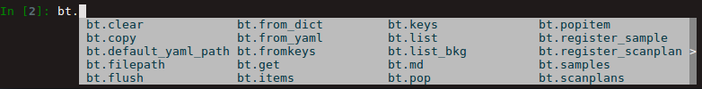

.. _usb_beamtime:

Setting up your Beamtime
------------------------

This should have been carried out by the beamline responsible.  To check all is ok,
carry out the following steps:

 #. Check you are in the collection environment
 #. Type ``bt``.  It should return similar output as following:

 .. code-block:: python

  >>> bt
  {'bt_experimenters': ['Tim', 'Liu'],
   'bt_piLast': 'Billinge',
   'bt_safN': '300564',
   'bt_uid': 'c76a6fe1',
   'bt_wavelength': 0.1832}

 If not, please contact your beamline responsible.

This object is like a container that contains some critical information about
your beamtime.  You can investigate what is inside.

To see the kinds of things that container contains, place a dot after bt and hit `tab`,
and all things it contains (but not their values) will be listed.

To see what those things contain, type ``bt.<thing>`` and hit return. For example, in our case:

.. code-block:: python

  In [3]: bt.wavelength
  Out[3]: 0.1832

So this is a beamtime (`'bt'`) type of object with name `'bt'`.  More interesting
is the metadata it contains:

.. code-block:: python

 >>> bt.md
 {'bt_experimenters': ['Tim', 'Liu'],
  'bt_piLast': 'Billinge',
  'bt_safN': '300564',
  'bt_uid': 'c76a6fe1',
  'bt_wavelength': 0.1832}

The instrument responsible created an initial version of ``bt`` with information
from the Safety Approval Form (SAF) form: the PI last name, the SAF number
and the experimenters.

When the beamtime object was created it created its very own unique-ID, the ``bt_uid``.
As long as you use the XPD acquisition software, every scan you make during your beamtime,
along with the other Beamtime level metadata,
will contain this ``'bt_uid'`` metadata field with the same uid value.
This can be searched for later in the scan headers and used to find all the data
collected during your beamtime, for example.

Some of the other things in the container are not quantities, or attributes, but
are functions, or `methods`.

.. code-block:: python

  >>> bt.list
  <bound method XPD.list of <class 'xpdacq.beamtime.Beamtime'>>

This means that ``bt`` not only contains things, but it can do things.  In this
case ``bt.list`` will list all the xpd-acquire-objects that have been created at
the time.  To execute a method you have to add parentheses at the end of ``bt.list()``
and hit return.  So far there is only 1 object, it is the `bt` object with name `bt`!

.. code-block:: python

>>> bt.list()

ScanPlans:
0: 'ct_5'
1: 'ct_0.1'
2: 'ct_1'
3: 'ct_10'
4: 'ct_30'
5: 'ct_60'

Samples:
0: Setup
1: Ni_calibrant
2: bkgd_kapton_0.9mmOD
3: bkgd_kapton_1mmOD
4: bkgd_kapton_0.5mmOD
5: activated_carbon_1
6: activated_carbon_2
7: activated_carbon_3
...

Before we move on, one more thing.  As we mentioned before, if ``bt`` doesn't exist,

.. code-block:: python

  >>> bt
  ---------------------------------------------------------------------------
  NameError                                 Traceback (most recent call last)
  <ipython-input-1-d0d7ab093f8d> in <module>()
  ----> 1 bt

  NameError: name 'bt' is not defined

please go and talk to your instrument responsible as there may be other aspects of the
environment setup that need to be fixed, but if you ever do have to create
(we call it `instantiate`) a new ``bt`` object, it is done like this:

.. code-block:: python

  >>> bt = Beamtime('Billinge',300256, ['Simon','Billinge', 'Chia-Hao','Liu'], 0.18326)

We will assume that ``bt`` exists.  Now we move on to the next step, :ref:`usb_experiment` within our beamtime.
